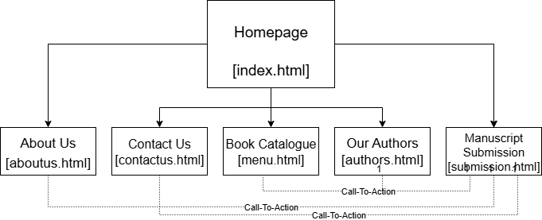

# Project Title: Trivest Publishing House Website

**Student Name:** Nkosinathi Ngema
**Student Number:** ST10489912
**Module:** WEDE5020 - Web Development (Introduction)

---

## Project Overview

The objective of this project is to create a professional and modern website for an organisation of our choice.
I decided to create a website for Trivest Publishing House, a smal publication company.
This website will feature the company's services and information on the company. It will increase it's online presence and provide information for users.

## Website Goals and Objectives

Number of submissions received through website
Number of sales through the website links
Growth in newsletter sign-ups

## Key Features and Functionality

- Responsive navigation menu
- About Us section with company history
- Services/Products showcase page
- Contact page with contact form

## Sitemap

## Timeline and Milestones

| Date | Milestone |
| :--- | :--- |
| [27 August 2025] | Part 1 Submission: HTML Structure & Proposal |
| [26 September 2025] | Part 2 Submission: CSS Styling |
| [Date not yet given] | Part 3 Submission: JavaScript & SEO |

## Part 1 Details

This section contains the initial HTML structure, project proposal, and content research for the website.

## Changelog

All notable changes to this project will be documented in this section.

| Date | Version | Description |
| :--- | :--- | :--- |
| 2025-08-18 | 0.1 | Created the folder structure and HTML pages. README.md file created.|
| 2025-08-19 | 0.2 | Added content to index.html and about.html. Created navigation links on all pages. |
| 2025-08-20 | 0.3 | Added forms to index.html, contactus.html, and submission.html. |
| 2025-08-21 | 0.4 | Added more content to menu.html and index.html. |
| 2025-08-22 | 0.5 | Added content to authors.html and aboutus.html. |
| 2025-08-23 | 0.6 | Added book covers to index.html and menu.html. |
| 2025-08-25 | 0.7 | Added footers to all the pages. |
| 2025-08-26 | 0.8 | Modified some content on all the footers and contactus.html. |

## References

​​Afrihost, 2025. Domains. [online] Available at: < <https://www.afrihost.com/domains> > [Accessed 07 August 2025].

​Afrihost, 2025. Cloud Hosting. [Online] Available at: < <https://www.afrihost.com/cloud-hosting> > [Accessed 07 August 2025]. ​​

W3Schools, 2025. *HTML Tutorial*. [online] Available at: < <https://www.w3schools.com/html/> > [Accessed: 25 August 2025].